# Option Pricing Model — 金融衍生物定价课程作业

一个基于 **CRR 二叉树模型** 与 **Black-Scholes 解析解** 的 Python 期权定价库，配套 **有限差分希腊字母（Greeks）** 计算，并包含收敛性验证。

理论依据：Shreve《金融随机分析 第 1 卷 —— 二叉树资产定价模型》。

---

## 1. 项目结构

```
Option_Pricing_Model/
├── README.md                项目说明（本文件）
├── main.py                  主入口（交互 CLI + 一键演示）
├── option_models.py         数据类型定义（合约 + 结果容器）
├── pricing_engines.py       定价引擎（CRR 二叉树 + Black-Scholes + 解析 Greeks）
├── greeks.py                希腊字母计算器（有限差分法）
├── visualize.py             可视化工具集（收敛图 / 希腊曲线 / 树结构图 / 策略收益图）
├── utils/
│   └── parity.py            Put-Call Parity 跨模型验证
└── figures/                 图片输出目录（运行后自动生成）
```

---

## 2. 计算流程图

以下 Mermaid 图以一组模拟参数（$S_0=100, \,K=100, \,r=5\%, \,\sigma=20\%, \,T=1, \,N=3$，欧式看涨）为例，完整展示系统从输入到输出的数据流与计算逻辑。

```mermaid
graph TD
    %% ============================================================
    %% 阶段一：输入参数
    %% ============================================================
    subgraph INPUT["① 输入参数 OptionContract 数据类"]
        direction LR
        S0["S₀ = 100"]
        K0["K = 100"]
        R0["r = 5%"]
        Sigma0["σ = 20%"]
        T0["T = 1"]
        N0["N = 3"]
        Type0["Call / European"]
    end

    %% ============================================================
    %% 阶段二：CRR 参数计算
    %% ============================================================
    INPUT --> CRR

    subgraph CRR["② CRR 参数计算 BinomialTreeEngine._compute_crr_params()"]
        dt_node["Δt = T/N = 0.3333"]
        u_node["u = e^(σ√Δt) = 1.1224"]
        d_node["d = 1/u = 0.8909"]
        growth_node["e^(rΔt) = 1.0168"]
        p_node["p̃ = (e^(rΔt) - d) / (u - d) = 0.5438"]
        q_node["q̃ = 1 - p̃ = 0.4562"]
        discount_node["折现因子 = e^(-rΔt) = 0.9835"]
    end

    %% ============================================================
    %% 阶段三：生成到期日股价
    %% ============================================================
    CRR --> StockTree

    subgraph StockTree["③ 到期日股价 _stock_prices_at_step(N=3)"]
        direction TB
        stock_formula["S₃(j) = S₀ · u^j · d^(3-j)"]
        leaf0["j=3: 100×1.1224³ = 141.40"]
        leaf1["j=2: 100×1.1224²×0.8909 = 112.24"]
        leaf2["j=1: 100×1.1224×0.8909² = 89.09"]
        leaf3["j=0: 100×0.8909³ = 70.71"]
    end

    %% ============================================================
    %% 阶段四：终端收益
    %% ============================================================
    StockTree --> TerminalPayoff

    subgraph TerminalPayoff["④ 终端收益 _intrinsic_value(S₃)"]
        direction TB
        payoff_formula["V₃(j) = max( S₃(j) - K, 0 )"]
        pay0["V₃(3) = max(141.40-100, 0) = 41.40"]
        pay1["V₃(2) = max(112.24-100, 0) = 12.24"]
        pay2["V₃(1) = max(89.09-100, 0) = 0"]
        pay3["V₃(0) = max(70.71-100, 0) = 0"]
    end

    %% ============================================================
    %% 阶段五：向后递推
    %% ============================================================
    TerminalPayoff --> Backward

    subgraph Backward["⑤ 向后递推 Backward Induction"]
        direction TB
        formula["V_n(j) = e^(-rΔt)[ p̃·V_{n+1}(j+1) + q̃·V_{n+1}(j) ]"]
        step2["n=2: V₂ = {0, 6.55, 27.63}"]
        step1["n=1: V₁ = {3.50, 17.71}"]
        step0["n=0: V₀ = 11.04"]
    end

    %% ============================================================
    %% 阶段六：行权方式分支
    %% ============================================================
    Backward --> ExerciseCheck

    ExerciseCheck{"exercise_type?"}
    ExerciseCheck -->|"EUROPEAN<br/>直接取 Continuation"| EuroPath
    ExerciseCheck -->|"AMERICAN<br/>比较提前行权 vs 继续持有"| AmPath

    subgraph EuroPath["欧式路径"]
        euro_result["V_n(j) = Continuation_n(j)"]
    end

    subgraph AmPath["美式路径 (最优停时)"]
        am_formula["V_n(j) = max(<br/>Intrinsic_n(j),<br/>Continuation_n(j)<br/>)"]
    end

    EuroPath --> Output
    AmPath --> Output

    %% ============================================================
    %% 阶段七：输出
    %% ============================================================
    Output["⑥ 输出: Option Price<br/>V₀ = 11.04<br/>(N=3 时; N→∞ 收敛至 BS ≈ 10.45)"]

    %% ============================================================
    %% 阶段八：扩展分支
    %% ============================================================
    Input2["OptionContract<br/>exercise_type = EUROPEAN"] -.-> BSEngine
    BSEngine["BlackScholesEngine.price()<br/>d₁ = [ln(S₀/K)+(r+σ²/2)T] / (σ√T)<br/>d₂ = d₁ - σ√T<br/>C = S₀·N(d₁) - K·e^(-rT)·N(d₂)<br/>= 10.45"] -.-> OutputBS
    OutputBS["输出: BS 解析价<br/>(用于收敛性验证)"]

    Output -.-> Greeks
    OutputBS -.-> Greeks

    Greeks["GreeksCalculator.compute_all()<br/>有限差分扰动 S₀, T, σ, r<br/>Δ ≈ [V(S₀+h)-V(S₀-h)] / 2h<br/>Γ ≈ [V(S₀+h)-2V(S₀)+V(S₀-h)] / h²<br/>Θ ≈ -[V(T-ε)-V(T)] / ε<br/>ν ≈ [V(σ+ε)-V(σ-ε)] / 2ε<br/>ρ ≈ [V(r+ε)-V(r-ε)] / 2ε"] --> GreeksOutput

    GreeksOutput["输出: PricingResult<br/>price + Δ, Γ, Θ, ν, ρ"]

    %% ============================================================
    %% 样式
    %% ============================================================
    style INPUT fill:#e1f5fe,stroke:#0288d1
    style CRR fill:#fff3e0,stroke:#f57c00
    style StockTree fill:#e8f5e9,stroke:#388e3c
    style TerminalPayoff fill:#fce4ec,stroke:#c62828
    style Backward fill:#ede7f6,stroke:#4527a0
    style Output fill:#fff9c4,stroke:#f9a825,stroke-width:3px
    style ExerciseCheck fill:#fff,stroke:#6a1b9a,stroke-width:2px
    style Greeks fill:#e0f2f1,stroke:#00695c
    style GreeksOutput fill:#fff9c4,stroke:#f9a825
    style OutputBS fill:#fff9c4,stroke:#f9a825
```



> **阅读说明**：
> - **实线箭头**（`-->`）表示主要计算流程：输入 → CRR 参数 → 股价树 → 终端收益 → 向后递推 → 输出。
> - **菱形节点** `exercise_type?` 对应代码 `pricing_engines.py:157` 对欧式/美式的分支判断。
> - **虚线箭头**（`-.->`）表示可选扩展路径：Black-Scholes 作为欧式期权的解析基准，GreeksCalculator 包装任意引擎输出希腊字母。
> - 图中 N=3 仅为示例（二叉树立即可见），实际使用时 `main.py` 默认 N=300，N→∞ 时二叉树价格收敛至 BS 价格 10.45。

---

## 3. 快速开始

### 3.1 依赖

```bash
pip install numpy scipy matplotlib
```

### 3.2 交互式定价（按提示输入参数）

```bash
cd Option_Pricing_Model
python main.py
```

按提示依次输入期权方向（call/put）、行权方式（european/american）、S₀、K、T、r、σ，选择定价引擎（bs/crr/all），即可得到期权价格与 Greeks。所有参数均可直接回车使用默认值。

### 3.3 一键演示（含可视化）

```bash
python main.py --demo
```

依次执行：
1. 欧式看涨 / 看跌 —— 二叉树 vs Black-Scholes 对比
2. 美式看跌 —— 提前行权溢价分析
3. Greeks —— 有限差分法（BS 引擎 vs 二叉树引擎）
4. 收敛性分析 —— N → ∞ 趋近 Black-Scholes，生成收敛图
5. Put-Call Parity 验证 —— BS + CRR 跨模型交叉检验
6. 教学可视化 —— 生成 4 张图到 `figures/`（树结构图、希腊曲线、Covered Call、Straddle）

---

## 4. 详细使用说明

### 4.1 启动 Python 交互环境

在项目目录下打开终端，输入：

```bash
python
```

然后逐行粘贴以下代码即可。

### 4.2 导入模块

```python
from option_models import OptionContract, OptionType, ExerciseType, PricingResult
from pricing_engines import BinomialTreeEngine, BlackScholesEngine
from greeks import GreeksCalculator
```

### 4.3 创建期权合约

以一组标准题目参数为例：

| 参数 | 符号 | 取值 | 说明 |
|---|---|---|---|
| 当前股价 | $S_0$ | 100 | 标的资产现价 |
| 执行价格 | $K$ | 105 | 虚值看涨 / 实值看跌 |
| 无风险利率 | $r$ | 0.05 | 连续复利年化 5% |
| 波动率 | $\sigma$ | 0.30 | 年化 30% |
| 到期时间 | $T$ | 1.0 | 1 年 |
| 二叉树步数 | $N$ | 200 | 步数越大越精确 |

```python
# ---- 欧式看涨 ----
call = OptionContract(
    S0=100, K=105, r=0.05, sigma=0.30, T=1.0,
    option_type=OptionType.CALL,
    exercise_type=ExerciseType.EUROPEAN
)

# ---- 欧式看跌 ----
put = OptionContract(
    S0=100, K=105, r=0.05, sigma=0.30, T=1.0,
    option_type=OptionType.PUT,
    exercise_type=ExerciseType.EUROPEAN
)

# ---- 美式看跌 ----
am_put = OptionContract(
    S0=100, K=105, r=0.05, sigma=0.30, T=1.0,
    option_type=OptionType.PUT,
    exercise_type=ExerciseType.AMERICAN
)
```

> **`OptionType` 可选值**：`OptionType.CALL`（看涨）、`OptionType.PUT`（看跌）
>
> **`ExerciseType` 可选值**：`ExerciseType.EUROPEAN`（欧式）、`ExerciseType.AMERICAN`（美式）
>
> **参数约束**：`S0 > 0`、`K > 0`、`sigma > 0`、`T > 0`、`r >= 0`，违反会直接抛出 `ValueError`。

### 4.4 二叉树定价

```python
# 创建引擎（指定步数 N=200）
bt_call = BinomialTreeEngine(call, N=200)

# 计算价格
price = bt_call.price()
print(f"二叉树欧式看涨: {price:.6f}")
```

查看二叉树内部参数（风险中性概率、乘数等）：

```python
print(f"Δt  = T/N            = {bt_call._dt:.6f}")
print(f"u   = exp(σ√Δt)      = {bt_call.u:.6f}")
print(f"d   = 1/u            = {bt_call.d:.6f}")
print(f"p̃   = (e^(rΔt)-d)/(u-d) = {bt_call.p_tilde:.6f}")
print(f"q̃   = 1-p̃            = {bt_call.q_tilde:.6f}")
```

### 4.5 Black-Scholes 解析解（仅欧式）

```python
bs_call = BlackScholesEngine(call)
bs_price = bs_call.price()
print(f"BS 欧式看涨: {bs_price:.6f}")
print(f"二叉树 vs BS 误差: {price - bs_price:.6f}")
```

> **注意**：`BlackScholesEngine` 仅接受 `ExerciseType.EUROPEAN`，传入美式会抛出 `ValueError`。

### 4.6 美式期权（提前行权溢价）

```python
bt_am_put = BinomialTreeEngine(am_put, N=200)
am_price = bt_am_put.price()
print(f"美式看跌: {am_price:.6f}")

bt_eu_put = BinomialTreeEngine(put, N=200)
eu_price = bt_eu_put.price()
print(f"欧式看跌: {eu_price:.6f}")
print(f"提前行权溢价: {am_price - eu_price:.6f}")
```

> 美式看跌的价格**严格大于**欧式看跌（因为提前行权权利有正价值）。
> 特别地，**不分红股票的美式看涨 = 欧式看涨**（Merton 1973），所以看涨不必单独测试美式。

### 4.7 计算希腊字母（有限差分法）

```python
greek_calc = GreeksCalculator()

# 可以调整步长（全部可选，有默认值）
# greek_calc.h_S = 1.0         # Delta/Gamma 的股价扰动
# greek_calc.eps_T = 1e-4      # Theta 的时间扰动
# greek_calc.eps_sigma = 1e-3  # Vega 的波动率扰动
# greek_calc.eps_r = 1e-4      # Rho 的利率扰动

result = greek_calc.compute_all(bt_call)

print(f"价格:   {result.price:.6f}")
print(f"Delta:  {result.delta:.6f}   (股价 +1, 期权变动 ≈ Delta)")
print(f"Gamma:  {result.gamma:.6f}   (股价 +1, Delta 变动 ≈ Gamma)")
print(f"Theta:  {result.theta:.6f}   (年化时间衰减)")
print(f"Vega:   {result.vega:.6f}   (σ +1(即 +100%), 期权变动 ≈ Vega)")
print(f"Vega/100: {result.vega/100:.6f}  (σ +1%, 期权变动 ≈ 此值)")
print(f"Rho:    {result.rho:.6f}    (r +1(即 +100%), 期权变动 ≈ Rho)")
print(f"Rho/100:  {result.rho/100:.6f}   (r +1%, 期权变动 ≈ 此值)")

# 也可单独计算某一个
delta_only = greek_calc.delta(bt_call)
```

> `GreeksCalculator` 适用于**任何**实现了 `.price()` 方法的引擎（二叉树或 Black-Scholes）。

### 4.8 收敛性检验

```python
bs_ref = BlackScholesEngine(call).price()
print(f"{'N':>6} {'二叉树':>10} {'BS':>10} {'误差':>12}")
for N in [5, 10, 20, 50, 100, 200, 500, 1000]:
    bt = BinomialTreeEngine(call, N=N).price()
    print(f"{N:6d} {bt:10.6f} {bs_ref:10.6f} {bt-bs_ref:+12.6f}")
```

预期：误差随 N 增大以 O(1/N) 速度衰减至 0。

### 4.9 验证 Put-Call Parity（无套利自检）

```python
C = BlackScholesEngine(call).price()
P = BlackScholesEngine(put).price()
import math
parity_lhs = C - P
parity_rhs = call.S0 - call.K * math.exp(-call.r * call.T)
print(f"C - P            = {parity_lhs:.6f}")
print(f"S0 - K*e^(-rT)  = {parity_rhs:.6f}")
print(f"差异:             {parity_lhs - parity_rhs:.6f}")
```

两者应几乎相等（差异 < 1e-10），这是无套利定价的基本检验。

### 4.10 使用内置 Parity 模块（跨模型验证）

```python
from utils.parity import check_parity

# 用 BS 验证
result_bs = check_parity(S0=100, K=100, T=1.0, r=0.05, sigma=0.20, model="bs")
print(f"BS:  passed={result_bs['passed']}, diff={result_bs['abs diff']:.2e}")

# 用 CRR 验证
result_crr = check_parity(S0=100, K=100, T=1.0, r=0.05, sigma=0.20, model="crr", N=500)
print(f"CRR: passed={result_crr['passed']}, diff={result_crr['abs diff']:.2e}")
```

输出 `passed=True` 且 `abs diff` 接近 0 即通过检验。

### 4.11 可视化

```python
from option_models import OptionContract, OptionType, ExerciseType
import visualize as viz

c = OptionContract(S0=100, K=100, r=0.05, sigma=0.20, T=1.0,
                   option_type=OptionType.CALL, exercise_type=ExerciseType.EUROPEAN)

# 二叉树结构图（教学用，N 不宜大于 6）
viz.plot_binomial_tree(c, N=4)

# 希腊字母 vs 标的价格曲线
viz.plot_greeks_vs_spot(K=100, T=1.0, r=0.05, sigma=0.20)

# 二叉树收敛图
viz.plot_binomial_convergence(c, N_max=200)

# 策略收益图
stock = OptionContract(S0=100, K=1e-9, r=0.05, sigma=0.20, T=1.0,
                       option_type=OptionType.CALL, exercise_type=ExerciseType.EUROPEAN)
call = OptionContract(S0=100, K=110, r=0.05, sigma=0.20, T=1.0,
                      option_type=OptionType.CALL, exercise_type=ExerciseType.EUROPEAN)
viz.plot_strategy_payoff("Covered Call", [(+1, stock), (-1, call)])
```

所有图片保存至 `figures/` 目录。

---

## 5. 数学背景速览

### 5.1 CRR 二叉树参数化（Cox-Ross-Rubinstein, 1979）

设 $\Delta t = T/N$：

$$\boxed{u = e^{\sigma\sqrt{\Delta t}},\qquad d = e^{-\sigma\sqrt{\Delta t}} = \frac{1}{u}}$$

$u \cdot d = 1$ 保证树是**重组的**（recombining），第 $n$ 步只有 $n+1$ 个不同股价节点，内存从 $O(2^N)$ 降为 $O(N)$。

**无套利条件**要求 $0 < d < e^{r\Delta t} < u$，在此条件下存在唯一的**风险中性概率**：

$$\boxed{\tilde{p} = \frac{e^{r\Delta t} - d}{u - d},\qquad \tilde{q} = 1 - \tilde{p} = \frac{u - e^{r\Delta t}}{u - d}}$$

### 5.2 向后递推（Backward Induction）

- **到期日终端条件**（第 $N$ 步，节点 $j = 0,1,\dots,N$，对应 $j$ 次上涨）：

$$S_N(j) = S_0 \cdot u^j \cdot d^{N-j}$$

$$V_N(j) = \begin{cases} \max(S_N(j) - K,\; 0) & \text{(Call)} \\ \max(K - S_N(j),\; 0) & \text{(Put)} \end{cases}$$

- **递推公式**（从 $n = N-1$ 倒退至 $0$）：

$$\boxed{V_n(j) = e^{-r\Delta t}\Big[\tilde{p}\cdot V_{n+1}(j+1) + \tilde{q}\cdot V_{n+1}(j)\Big]}$$

- **美式扩展** —— 在每一步、每个节点比较"立即行权价值"与"继续持有价值"：

$$\boxed{V_n(j) = \max\Big(\text{Intrinsic}_n(j),\; e^{-r\Delta t}\big[\tilde{p}\cdot V_{n+1}(j+1) + \tilde{q}\cdot V_{n+1}(j)\big]\Big)}$$

这体现了**最优停时**（Optimal Stopping Time）思想：持有者在每个节点选择最大化期权价值的行动。

### 5.3 Black-Scholes 解析解（欧式期权）

$$d_1 = \frac{\ln(S_0/K) + (r + \sigma^2/2)T}{\sigma\sqrt{T}},\qquad d_2 = d_1 - \sigma\sqrt{T}$$

$$\boxed{C = S_0 N(d_1) - K e^{-rT} N(d_2)}$$

$$\boxed{P = K e^{-rT} N(-d_2) - S_0 N(-d_1)}$$

其中 $N(\cdot)$ 为标准正态累积分布函数。

> **仅适用于欧式期权**。对美式期权调用 `BlackScholesEngine` 会抛出 `ValueError`。

### 5.4 希腊字母（有限差分法）

| 希腊字母 | 公式 | 差分近似 | 对冲含义 |
|---|---|---|---|
| Δ (Delta) | $\partial V/\partial S$ | $\frac{V(S_0+h) - V(S_0-h)}{2h}$ | 1 单位期权需持有 Δ 单位标的 |
| Γ (Gamma) | $\partial^2 V/\partial S^2$ | $\frac{V(S_0+h) - 2V(S_0) + V(S_0-h)}{h^2}$ | Delta 变化速率，决定再平衡频率 |
| Θ (Theta) | $-\partial V/\partial T$ | $-\frac{V(T-\varepsilon) - V(T)}{\varepsilon}$ | 时间价值衰减速度 |
| ν (Vega) | $\partial V/\partial \sigma$ | $\frac{V(\sigma+\varepsilon) - V(\sigma-\varepsilon)}{2\varepsilon}$ | 波动率风险暴露 |
| ρ (Rho) | $\partial V/\partial r$ | $\frac{V(r+\varepsilon) - V(r-\varepsilon)}{2\varepsilon}$ | 利率风险暴露 |

> 实践中 Vega 和 Rho 常除以 100 来解读（即 1% 的波动率或利率变化对应的价格变动）。

### 5.5 Put-Call Parity（不分红欧式）

$$\boxed{C - P = S_0 - K e^{-rT}}$$

无套利原理的最直接推论，用于交叉验证定价引擎的正确性。

---

## 6. 基准对比

参数：`S0=100, K=100, r=5%, σ=20%, T=1, European Call`

| 模型 | 价格 | 与 BS 的差 | 说明 |
|---|---|---|---|
| Black-Scholes（闭式） | 10.4506 | 0（基准） | 瞬时计算 |
| CRR 二叉树 (N=300) | 10.4439 | -0.0067 | 离散化误差 |
| CRR 二叉树 (N=1000) | 10.4486 | -0.0020 | 误差随 N 增大衰减 |

---

## 7. 模型选择指引

| 需求 | 推荐方式 | 备注 |
|---|---|---|
| 欧式期权快速定价 | `BlackScholesEngine.price()` | 闭式解，瞬时出结果 |
| 欧式期权 + Greeks（数值） | `GreeksCalculator.compute_all()` 配合任意引擎 | 统一有限差分接口 |
| 欧式期权 + Greeks（解析） | `BlackScholesEngine.delta()` / `.gamma()` 等 | 精度更高，已按行业惯例归一化 |
| 美式期权定价 | `BinomialTreeEngine` | BS 不能用于美式 |
| 教学验证 / 收敛性分析 | 两者对比 + `BinomialTreeEngine.convergence_study()` | 展示 CRR → BS 的收敛过程 |
| 二叉树教学可视化 | `visualize.plot_binomial_tree()` | 画 N=4 的完整股价 + 价值树 |
| Put-Call Parity 自检 | `utils.parity.check_parity()` | 跨模型验证，确保无套利 |

---

## 8. 与课堂理论（Shreve 第 1 卷）的对应

| 理论概念 | 代码位置 | 对应公式 |
|---|---|---|
| 风险中性概率 $\tilde{p}, \tilde{q}$ | `pricing_engines.py _compute_crr_params()` | $\tilde{p} = \frac{e^{r\Delta t}-d}{u-d}$ |
| 上升/下降乘数 $u, d$ | `pricing_engines.py _compute_crr_params()` | $u = e^{\sigma\sqrt{\Delta t}},\; d = 1/u$ |
| 无套利条件检查 | `pricing_engines.py:91-95` | $0 \leq \tilde{p} \leq 1$ |
| 向后递推定价 | `pricing_engines.py price()` | $V_n = e^{-r\Delta t}[\tilde{p}V_{n+1}^u + \tilde{q}V_{n+1}^d]$ |
| 最优停时（美式） | `pricing_engines.py` `is_american` 分支 | $V_n = \max(\text{Intrinsic}, \text{Continuation})$ |
| Black-Scholes 公式 | `pricing_engines.py BlackScholesEngine.price()` | $d_1, d_2$ → Call/Put |
| 解析希腊字母 | `pricing_engines.py BlackScholesEngine.delta()` 等 | $\Delta = N(d_1)$, $\Gamma = N'(d_1)/(S_0\sigma\sqrt{T})$ |
| Delta 对冲（有限差分） | `greeks.py delta()` | $\Delta \approx [V(S_0+h)-V(S_0-h)]/2h$ |
| Put-Call Parity | `utils/parity.py check_parity()` | $C-P = S_0 - Ke^{-rT}$ |
| 二叉树 return_tree | `pricing_engines.py price(return_tree=True)` | 返回完整股价 + 价值矩阵 |
| 收敛性研究 | `pricing_engines.py convergence_study()` | CRR → BS as $N \to \infty$ |

---

## 9. 已知限制 & 扩展方向

- **不分红假设**：当前不支持连续分红 $q$。如需支持，将代码中的 $r$ 替换为 $r - q$ 即可
- **二叉树希腊字母精度**：二叉树在有限差分求 Gamma 时有网格噪声，建议 N ≥ 500，或直接用 `BlackScholesEngine` 的解析 Greeks
- **蒙特卡洛未实现**：本作业聚焦二叉树模型，未包含 Monte Carlo 模拟（路径依赖期权需 MC）
- **常数波动率**：假设 $\sigma$ 为常数，未引入波动率微笑 / 曲面
- **无期权组合策略类**：`visualize.plot_strategy_payoff()` 可绘制任意组合的收益图，但未封装专门的 Strategy 类
- **路径依赖期权**：二叉树的重组性质丢失了路径信息，亚式 / 障碍期权需 Monte Carlo 处理

